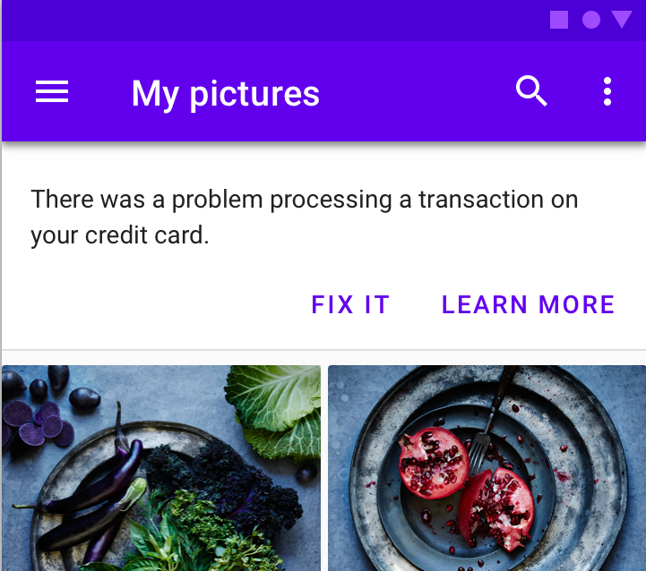

# Webpack {
	data-background-image="../images/logo-webpack.svg"
	data-background-size='40%'
	}

## ¿Qué aporta? {
	data-background-image="../images/logo-webpack.svg"
	data-background-size='40%'
	}


A partir del codigo fuente, genera los ficheros que se bajará el navegador.

Vamos que compila, ¿pero Javascript no era interpretado?

A medida que los proyectos se hacen grandes, es necesario
modularizar, descartar modulos no usados, agregar el resto, optimizar, preprocesar...

## Ejemplo real {
	data-background-image="../images/logo-webpack.svg"
	data-background-size='40%'
	}

Repositorio `webforms-mithril` ([link](https://github.com/Som-Energia/webforms-mithril/blob/master/webpack.config.js){ target=_blank })

La configuración de webpack en `webpack-config.js`

Comandos de `webpack` en los `scripts` del `package.json`


## Modulos en Javascript {
	data-background-image="../images/logo-webpack.svg"
	data-background-size='40%'
	}


A pelo, Javascript ES5 no sabe de modulos.

Se incluye cada .js en el html con `<script>`.

Tambien las dependencias!

Todo va al scope global. No hay `namespaces`.

Se usan funciones auto-llamadas para aislar.

## ¿Cómo funciona? {
	data-background-image="../images/logo-webpack.svg"
	data-background-size='40%'
	}


Explora las dependencias entre los módulos y genera código para:

- aislar el espacio de nombres de cada módulo
- indexar los módulos por el path
- implementar `require` para cargarlos

Tambien modifica el html para incluir los assets finales

## Definición de módulos {
	data-background-image="../images/logo-webpack.svg"
	data-background-size='40%'
	}


```javascript
// mymodule.js
'use strict'; // Activa errors per variables no declarades

function myfunction() {
	return 'hello world';
}

module.exports = myfunction;
```

```javascript
// main.js
'use strict'; // Activa errors per variables no declarades

var imported = require('./mymodule');

console.debug(imported()); // should show 'hello world'
```

## El bundle (envoltorio) {
	data-background-image="../images/logo-webpack.svg"
	data-background-size='40%'
	}


```javascript
(function(modules) { // funcion auto-llamada
	var installedModules = {}; // The module cache
	function require(moduleId) {
	    // Check if module is in cache
	    if(installedModules[moduleId]) {
	 	    return installedModules[moduleId].exports;
	    }
	    // Create a new module (and put it into the cache)
	    var module = installedModules[moduleId] = {
	 	    i: moduleId,
	 	    exports: {}
	    };
	    // Execute the module function
	    modules[moduleId].call(module, module.exports, require);
	    // Return the exports of the module
	    return module.exports;
	}
	require('./main'); // el entry point del bundle
}) ({
	'./mymodule': function(module, exports, require) {
		eval('string con el contenido del fichero');
	},
	'./main': function(module, exports, require) {
		eval('string con el contenido del fichero');
	},
});
```

## Entry points y bundles {
	data-background-image="../images/logo-webpack.svg"
	data-background-size='40%'
	}


**Entry point:** Punto de partida (js) de donde estirar las dependencias.
Puede haber varios (diferentes páginas)

Los navegadores cargan más rápido un fichero mediano que muchos pequeños.

**Bundle:** Un fichero que junta las dependencias de un punto de partida.

## Configuración {
	data-background-image="../images/logo-webpack.svg"
	data-background-size='40%'
	}


```javascript
var config = {
    context: path.resolve(__dirname, 'src'), // our code's root
    entry: {
        main: './main',   // bundle name -> src/main.js
    },
    output:
		// Apends a chunkhash to force reloading
        filename: 'bundle-[name]-[chunkhash].js',
    },
    plugins:[
		// webpack deals with js. html by plugins
        // Generaes html to insert generated css and js
        new HtmlWebpackPlugin({
            filename: 'index.html',
            }),
```

## Chunks {
	data-background-image="../images/logo-webpack.svg"
	data-background-size='40%'
	}

Un fichero grande también es peor que varios medianos. Fragmentemos.

Los assets se generan con un **hash** en el nombre para forzar recarga de cache si hay cambios.

Las dependencias _vendor_ son menos proclives a cambiar, si las separamos tendran mas hits de cache.

Con varios _entry points_, habrá cosas comunes entre los bundles.
Separando lo común y lo particular, se optimiza la carga
de múltiples páginas.

## Múltiples entradas {
	data-background-image="../images/logo-webpack.svg"
	data-background-size='40%'
	}

```javascript
	...
    entry: {
        main: './main',
		contact: './contact', // added: second entry point
    },
    output:
        filename: 'bundle-[name]-[chunkhash].js',
		// added: id would be 'main~contract` for the shared one
        chunkFilename: 'chunk-[id]-[chunkhash].js', // added
    },
    plugins:[
        new HtmlWebpackPlugin({filename: 'index.html'}),
		// Each page should have its html plugin
        new HtmlWebpackPlugin({filename: 'contact.html'}),
```

## Otros recursos (assets) {
	data-background-image="../images/logo-webpack.svg"
	data-background-size='40%'
	}


Datos (json, xml, yaml),
estilos (css, sass, less, stylus),
imagenes (png, jpg, svg)
...

Se _requieren_ como si fueran javascripts.

Una cadena de _loaders_ se encarga
de que esten disponibles en el navegador.

<div class='notes'>

- Como string en el js, añaden codigo js para que este disponible
- En su propio bundle, modifican el html para incluirlo

</div>

## Transcripción {
	data-background-image="../images/logo-webpack.svg"
	data-background-size='40%'
	}

Los loaders nos permiten **traducir recursos** en formatos
no soportados por los navegadores.

- CSS: Sass, Less, Stylus
- Javascript: ES6, CoffeScript, TypeScript
- HTML: Markdown, RST, Jade
- Datos: XML, JSON, YAML
- Imagenes, videos, fuentes...

También se usan para la **optimización**.
Minifiers, uglifiers, imagenes multiresolución...

## Disposición {
	data-background-image="../images/logo-webpack.svg"
	data-background-size='40%'
	}

Los loaders determinan en que forma estará disponible
el recurso y lo hacen accesible de forma transparente

Como ficheros independientes

Como **strings en el bundle javascript**

Extraidos en **su propio bundle**

**Insertados** en otro recurso

## Loaders {
	data-background-image="../images/logo-webpack.svg"
	data-background-size='40%'
	}

`config.module.rules` como cargar cada recurso.

```javascript
rules: [
	// yaml-loader: yaml data -> json data
	// json-loader: json data -> js object
	// you get it with 'require'
	{ test: /\.yaml$/, use: ["json-loader", "yaml-loader" ] },

	// stylus-loader:  stylus -> css
	// css-loader: css -> js code that adds the style
	// MiniCssExtractPlugin: extracts into a css bundle
	// 'require' ensures that the css is loaded
	// as any dependant assets (images, includes...)
	{ test: /\.styl$/, use: [ MiniCssExtractPlugin.loader,
			"css-loader", "stylus-loader"]},
	// The css bundle is configured in the plugin section
```
## Plugins {
	data-background-image="../images/logo-webpack.svg"
	data-background-size='40%'
	}

Los _loaders_ son solo tuberias.

Los _plugins_ aportan loaders nuevos pero tambien otra funcionalidad.

`HtmlWebPackPlugin`: Genera un html a partir de un template incluyendo uno o varios chunks (js, css...)

```javascript
plugins: [
	new HtmlWebPackPlugin({
		filename: 'index.html',
		template: 'mithriltemplate.html',
		chunks: ['example', 'common'],
	}),
]
```


## Integración Back-end {
	data-background-image="../images/logo-webpack.svg"
	data-background-size='40%'
	}


**Problema:** el HTML lo genera la aplicacion de backend (flask, django, php), no webpack.

Hay **plugins de webpack** que generan **manifiestos**
con la **lista de assets**.

Hay **extensiones para Flask y Django** que integran esa lista en las páginas.

**Estrategia:** en backend pocas páginas y mucha API.


## Servidor de desarrollo {
	data-background-image="../images/logo-webpack.svg"
	data-background-size='40%'
	}


`webpack-dev-server --open -d `

o `npm run server`

Lanza un webserver NodeJS local con los assets

Apunta el navegador a la página principal.

Detecta cambios en los ficheros,
regenera los assets del servidor y
recarga el navegador.

Agiliza mucho el ciclo de desarrollo.


## Source Maps {
	data-background-image="../images/logo-webpack.svg"
	data-background-size='40%'
	}

Con tanta transformación, 
¿cómo relacionamos un error en el navegador con el código fuente?

En modo desarrollo webpack genera _source maps_.
Comentarios especiales que referencian al código original,
fichero y linia.

Los navegadores modernos los entienden y generan _stack traces_ usables.


# Mithril {
	data-background-image="../images/logo-mithril.svg"
	data-background-size='40%'
	}

## Frameworks {
	data-background-image="../images/logo-mithril.svg"
	data-background-size='40%'
	}

HTML y CSS permiten algunas animaciones y respuesta interactiva,
pero son en esencia estàticos. 
**JavaScript** permite modificar el HTML en el navegador.

La **librería estándar** no es muy potente.
Hay **librerías** que la complementan:
JQuery, Underscore, Sugar...

No es suficiente abstracción para construir aplicaciones complejas.
Ahí entran los **frameworks**:
Vue, React, Angular, Mithril...

## Componentización {
	data-background-image="../images/logo-mithril.svg"
	data-background-size='40%'
	}

Los frameworks suelen dar una forma de definir
**componentes gráficos** o **widgets**.

En HTML sería un **tag propio**,
que controlamos **vía atributos**,
y que **abstrae** un HTML más complejo.

Se pueden replicar y juntar con otros para armar
nuevos componentes.

## Interacción Modelo-Vista {
	data-background-image="../images/logo-mithril.svg"
	data-background-size='40%'
	}

Cada framework llama _vista_, _modelo_ o _controlador_ a cosas distintas.
El patron MVC **original** no era práctico y nadie lo usa tal cual.
Pero quedó la idea: **Separar la presentación de los datos**.

El framework define:

Como el modelo (datos js) altera la vista (html)

Como lo que pasa en la vista modifica el modelo

<div class="notes">

- En el Modelo-Vista-Controlador original habia tres clases.
- El controlador era el unico que conoce a los otros dos y recibe notificaciones de ambos.
- Como patron es bastante limitante pero se quedaron los conceptos.
- Las vistas tienen su propio modelo (estado) interno.
- Como se resuelve la agregacion de vistas?
- Todo el mundo llama MVC a lo suyo y hablan de cosas muy distintas.

</div>

## Ventajas de Mithril {
	data-background-image="../images/logo-mithril.svg"
	data-background-size='40%'
	}

- Ligero: muy pocos k's
- Rápido: Usa DOM virtual
- Simple: API minimalista
- Potente: A pesar de la simplicidad

<div class="notes">

- DOM es la API que ofrece el navegador para manipular el html
- Manipular el DOM es bastante lento
- Un DOM virtual permite detectar las diferencias y modificar quirurgicamente

</div>

## Hola mundo {
	data-background-image="../images/logo-mithril.svg"
	data-background-size='40%'
	}

```html
...
<div id='mithril-target' class='main'>
	<div class='loading'><b>Loading...</b></div>
</div>
...
```

```javascript
var m = require('mithril');

window.onload = function() {
	var element = document.getElementById('mithril-target');
	m.render(element, m('h1', 'Hola mundo'));
};
```

## Hola mundo, comentado {
	data-background-image="../images/logo-mithril.svg"
	data-background-size='40%'
	}

`m.xxxx` - acceso a funciones de la api Mithril.

`m(...)` - como función genera nodos virtuales.

Los **nodos virtuales** (vnodes) representan HTML sin usar el DOM directamente, que es lento.

`m.render` convierte nodos virtuales en HTML.

Renderiza solo una vez, nos vale para ejemplos.
Veremos adelante como actualizar.

## Generando vnodes {
	data-background-image="../images/logo-mithril.svg"
	data-background-size='40%'
	}

```javascript
// Sintaxis general
m(tag, attrs, children, children2, ...);

// tag: sintaxis css
'h1'                // <h1>
'.sidebar.black'    // <div class="sidebar black">
'#mytag'            // <div id="mytag">
'[title="tooltip"]' // <div title="tooltip">
// Combinable:
'input.mdc-input#name[type="text"]'

// attrs: (opcional) diccionario con más attributos
// children: (opcional, multiple) string, vnodes o lista childrens
```

## Hyperscript {
	data-background-image="../images/logo-mithril.svg"
	data-background-size='40%'
	}

```javascript
var backuri = 'http://example.com';
return m('section#section1',[ // <section id="section1>
	m('h2', 'Titulo'),             //   <h2>Titulo</h2>
	m('p.first','yes'),            //   <p class="first">yes</p>
	m('p','no'),                   //   <p>no</p>
	m('nav.backlink', [            //   <nav class="backlink">
		m('a[target="_blank"]', {  //     <a target="_blank"
			'href': backuri,       //       href="http://examp..."
		},                         //     >
			'Volver atras'         //       Volver atras
		),                         //     </a>
	]),                            //   </nav> 
]);                                // </section>
```
## Control flujo {
	data-background-image="../images/logo-mithril.svg"
	data-background-size='40%'
	}

Las estructuras de control `if`  y `for` rompen la estructura visual del hyperscript.

Mejor usar expresiones ternarias o cortocircuitos booleanos y, para los loops, `map`.

```javascript
var verduras = ['judias', 'acelgas', 'espinacas'];
var selected = 'judias';
return m('ul',
	verduras.map(function(verdura, i) {
		return m('li', i+1, ' - ', verdura,
			verdura==selected?" selected":null),
		);
	})
);

```


## vnodes por dentro {
	data-background-image="../images/logo-mithril.svg"
	data-background-size='40%'
	}

Es un objeto/diccionario con:

- `tag`, `attrs` y `children`: los parámetros del `m`
- `text`: si solo hay un children y es texto
- `dom`: elemento DOM renderizado (si lo está)
- `state`, `key`: los veremos

Manipular el DOM dispara el redibujado.
Los vnodes son baratos de crear y comparar.
Vale la pena generarlos a menudo
a cambio de juntar cambios en un solo redibujado.


## Primer componente {
	data-background-image="../images/logo-mithril.svg"
	data-background-size='40%'
	}

```javascript
// Nuestro primer componente!
var Hello = {
	// render llama al método view pasandole el vnode original
	// Retornamos el vnode que se renderizará en su lugar
	view: function(vn) {
		// podemos acceder a los attributos del vnode original
		return m('h1', 'Hola '+vn.attrs.name||'mundo');
	},
};

window.onload = function() {
	var element = document.getElementById('mithril-target');
	// Usamos el componente como tag
	m.render(element, m(Hello, {name: 'Voki'}));
};
```

## Montando la app {
	data-background-image="../images/logo-mithril.svg"
	data-background-size='40%'
	}

La funcion `m.mount` activa el sistema de actualización.
Después de cada evento se dispara un renderizado, si hay cambios se redibuja el DOM.

```javascript
var App = {};
App.view = function(vn) { return m('h1', 'Hola mundo'); },

window.onload = function() {
	var element = document.getElementById('mithril-target');
	m.mount(element, App); // mount, no render!
};
```
**Ojo!** Al `mount` le pasamos un componente, `App`,
no un vnode, `m(App)`, como al `render`.


## Componente _contenedor_ {
	data-background-image="../images/logo-mithril.svg"
	data-background-size='40%'
	}

Igual que usábamos `vn.attrs`, podemos propagar `vn.children`
al _virtual node_ resultante.

```javascript
var RedBox = {};
RedBox.view = function(vn) {
	return m('', {style: 'border:3pt solid red'}, vn.children);
};

var App = {};
App.view = function(vn) {
	return m(RedBox,
		m('h1', 'Dress in red'),
		m('.content', 'bla bla'),
	);
};
```

## Controlando un modelo {
	data-background-image="../images/logo-mithril.svg"
	data-background-size='40%'
	}

```javascript
var Person = { name: 'anonymous' };  // the model

var PersonEditor = {};
PersonEditor.view = function(vn) {
	return m('',[
		m('input', {
			value: Person.name, // Model -> View
			oninput: function(ev) {
				Person.name = ev.target.value; // View -> Model
			},
		}),
		m('', 'hello ' + Person.name), // Model -> View (again)
	]);
};
```


## Estado interno {
	data-background-image="../images/logo-mithril.svg"
	data-background-size='40%'
	}

`vn.state`: objeto que mantiene el estado del widget

```javascript
PersonEditor.var1 = 1; // inicializa vn.state.var1

// Inicializa el estado en oninit
// Se llama antes de inicializar el DOM
PersonEditor.oninit = function(vn) {
	vn.state.var2 = 'value2';
	// vn.state se pasa como this a los metodos del componente
	this.var3 = 'value3'; // igual que vn.state.var3
};
```

**¡Ojo!** Distingue entre estado interno y modelo


## Acceso al dom {
	data-background-image="../images/logo-mithril.svg"
	data-background-size='40%'
	}

Hay que evitar manipular el DOM directamente.

A veces es necesario  por el uso de otras librerías.
(Como MDC4W).

`vn.dom`: apunta al DOM renderizado

El componente puede implementar hooks que se llaman en diferentes momentos del ciclo de vida.

En `vn.oninit()` no está disponible porque no se ha ejecutado aún ningún render.

## Ciclo de vida (I) {
	data-background-image="../images/logo-mithril.svg"
	data-background-size='40%'
	}
`oninit`: Antes de llamar al `view` la primera vez.
Para inicializar `vn.state` a partir de `vn.attrs`.
Cosas que no necesiten el DOM.

`oncreate`/`onupdate`: Tras insertar/actualizar el DOM después de un render.
Para llamar librerias que necesitan el DOM o consultar layout final.

**¡Ojo!** Cambios en el modelo aquí, no disparan render.

## Ciclo de vida (II) {
	data-background-image="../images/logo-mithril.svg"
	data-background-size='40%'
	}

`onremove`: Para tareas de limpieza.  Se llama justo antes de eliminar el nodo.

`onbeforeremove`: Para transiciones de salida. Retorna un `Promise`.
Se retrasa el `onremove` y la eliminación del nodo hasta que el `Promise` resuelva.


## Conciliar con claves {
	data-background-image="../images/logo-mithril.svg"
	data-background-size='40%'
	}

Es difícil saber que nodo virtual corresponde si
reordenamos los nodos o si cambian demasiado.

Mithril permite asociar al virtual node una clave,
`vn.key`, para asegurar que el mapeo es correcto.

## Consultas a APIs {
	data-background-image="../images/logo-mithril.svg"
	data-background-size='40%'
	}

```javascript
m.request({
	url: 'https://example.com/api/persona',
	method: 'POST',
	data: {
		name: Persona.name,
	},
}).then(function(response) {
	
}, function(error) {

});
```

Se refresca la interfaz despues de recibir la respuesta.

Por defecto JSON, personalizable.

## Personalizar la response {
	data-background-image="../images/logo-mithril.svg"
	data-background-size='40%'
	}

Diferentes niveles de personalizacion partiendo de:

`extract(xhr, options)`: acceso a toda la respuesta, por defecto pasa `xhr.responseText`

`deserialize(responseText)`: a partir del responseText, por defecto parser JSON

`type(object)`: objeto JSON parseado, por defecto identidad


## Personalizar la request {
	data-background-image="../images/logo-mithril.svg"
	data-background-size='40%'
	}

`data`: datos que serializan en el body o en la request

`headers`: añade cabeceras

`config`: permite modificar las cabeceras de la request

`serialize`: aplicado a data, por defecto `JSON.serialize`


# Material Design {
	data-background="../images/logo-materialdesign.svg"
	data-background-size='40%'
	}

## Librerias componentes {
	data-background="../images/logo-materialdesign.svg"
	data-background-size='40%'
	}

Bootstrap (Twitter)

Material (Google)

JQuery-UI

...

## Origen {
	data-background="../images/logo-materialdesign.svg"
	data-background-size='40%'
	}

<div class="columns">

<div class="column" style="width:60%">

**Material Design** http://material.io

**Especificación** de cómo han de ser las interfaces en **Android**
a partir de Lollypop

Generalizado a otros soportes como el web.

Multiples implementaciones.

</div>
<div class="column" style="width:30%">
{width=100%}
</div>
</div>


## Component List {
	data-background="../images/logo-materialdesign.svg"
	data-background-size='40%'
	}

<div class="columns">
<div class="column">
Button

Slider

Switch

TextField

Selects

Checkbox

RadioButton
</div>
<div class="column">
LayoutGrid

List

GridList

ImageList

Tabs

Chip

Progress
</div>
<div class="column">
AppBar

Drawer

Card

SnackBar

Banner

Dialog

Sheet
</div>
</div>


## Navegación {
	data-background="../images/logo-materialdesign.svg"
	data-background-size='40%'
	}


**Lateral:** pantallas al mismo nivel accesibles en todo momento.
(Tabs, Drawer, Bottom Navigation Bar)

**Progreso:** profundizar en el nivel jerárquico
(Button, List, Grid List, Image list...)

**Atrás:** Cronológico o jeràrquico
(Back button)

## Comunicación {
	data-background="../images/logo-materialdesign.svg"
	data-background-size='40%'
	}


<div class=columns>
<div class=column style="width:30%">
{width=80%}

Persistente

Bloqueante
</div>
<div class=column style="width:30%">


Persistente

No bloqueante
</div>
<div class=column style="width:30%">


Temporal
</div>

## Sistema de Color {
	data-background="../images/logo-materialdesign.svg"
	data-background-size='40%'
	}

{width="60%"}

## Tema de Color {
	data-background="../images/logo-materialdesign.svg"
	data-background-size='40%'
	}

**Primary**, **Secondary** y sus variantes **light** y **dark**.

Las **variantes** para destacar de forma harmoniosa.

**Secondary** para dar acento especial.

**Background** para el fondo estatico.

**Surface** para las cosas que se elevan sobre el fondo.

**OnX:** El color de texto cuando se usa _X_ como fondo


## ¿Material para Mithril? {
	data-background="../images/logo-materialdesign.svg"
	data-background-size='40%'
	}

**[Polythene](https://github.com/ArthurClemens/Polythene):**
Lo usamos en el [Tomàtic](https://github.com/Som-Energia/somenergia-tomatic).
Calcula los estilos en el navegador,
y pierde lo que ganas con Mithril.

**Mithril MDL:** wrapper para Mithril de Material Design Lite de Google.
Menos completo, mucho más rápido. Estilos precompilados.

MDL fue discontinuado en favor de
**Material Components 4 Web**
que aún no tiene wrapper Mithril.


## MD Components 4 Web {
	data-background="../images/logo-materialdesign.svg"
	data-background-size='40%'
	}

Implementación Web de Google

Incompleta como todas, en progreso rápido.

En vez de concentrarse en un framework da herramientas
para usarlo en cualquiera.

Nosotros haremos el wrapping para Mithril:
`src/mdc/` ([link](https://github.com/Som-Energia/webforms-mithril/tree/master/src/mdc))


## Estructura {
	data-background="../images/logo-materialdesign.svg"
	data-background-size='40%'
	}

**Estilos:**

Implementados con Sass.

Customizables (¡precalculados!)

**Javascript:**

Cuando necesitan inicializacion

Cuando Ofrecen API.

## MDC Button en Mithril {
	data-background="../images/logo-materialdesign.svg"
	data-background-size='40%'
	}

Sin Javascript, basado solo en estilos

```javascript
require('@material/button/dist/mdc.button.css');
var Button = {
	view: function(vn) {
		return  m('button.mdc-button'
			+(vn.attrs.raised ? '.mdc-button--raised':'')
			+(vn.attrs.unelevated ? '.mdc-button--unelevated':'')
			+(vn.attrs.outlined ? '.mdc-button--outlined':'')
			+(+vn.attrs.dense ? '.mdc-button--dense':'')
			, attrs, [
			(vn.attrs.faicon ? m(
				'i.mdc-button__icon.fa.fa-'+vn.attrs.faicon):''),
			vn.children
		]);
	},
};
```

## Uso del MDC Button {
	data-background="../images/logo-materialdesign.svg"
	data-background-size='40%'
	}

```javascript
var Button = require('./mdc/button');

var App = {
	clicked: false,
	view: function(vn) {
		return  m(Button, {
			raised: true,
			faicon: this.clicked?'spinner.fa-spin':'paper-plane',
			onclick: function(ev) {
				vn.state.clicked = true;
			},
		}, 'Send');
	},
};
```

## Como pinta {
	data-background="../images/logo-materialdesign.svg"
	data-background-size='40%'
	}


## MDC Dialog en Mithril {
	data-background="../images/logo-materialdesign.svg"
	data-background-size='40%'
	}

Inicializando y con API.

```javascript
const mdcDialog = require('@material/dialog');
const MDCDialog = mdcDialog.MDCDialog;
var Dialog = {};
Dialog.oninit = function(vn) {
	// Para poder acceder desde fuera a la API
	vn.state.model = vn.attrs.model || {};
	// Api publica del componente Mithril
	vn.state.model.open = function() {
		vn.state.widget.show();
	};
};
Dialog.oncreate = function(vn) {
	vn.state.widget = MDCDialog.attachTo(vn.dom);
	vn.state.widget.listen('MDCDialog:accept', function() {
		vn.attrs.onaccept && vn.attrs.onaccept();
	});
	vn.state.widget.listen('MDCDialog:cancel', function() {
		vn.attrs.oncancel && vn.attrs.oncancel();
	});
};
```


