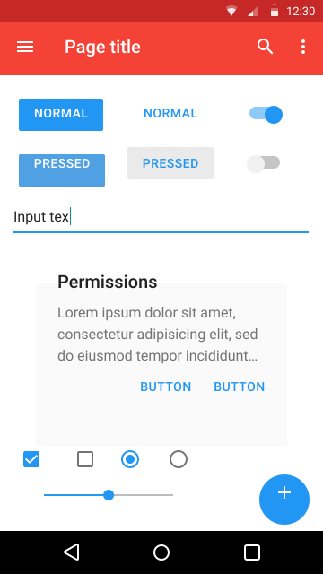
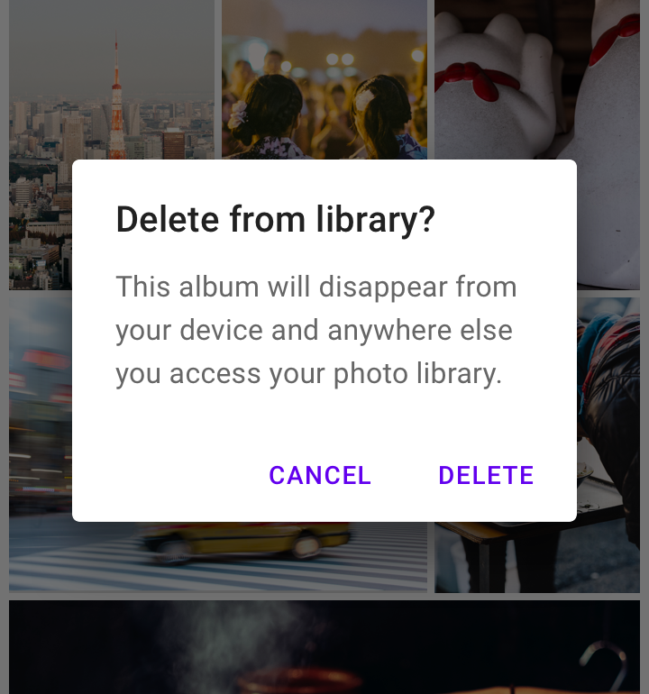
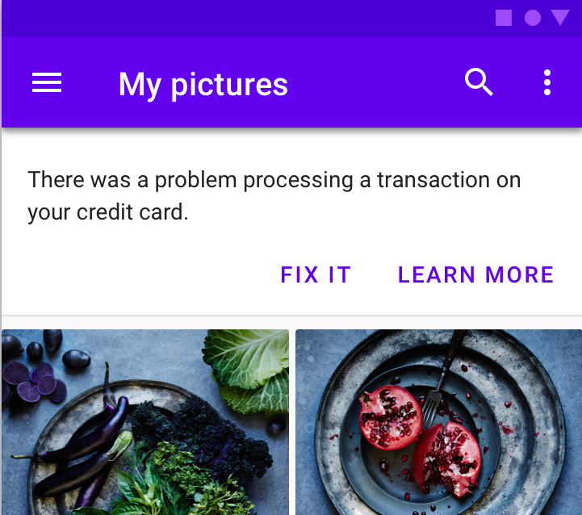
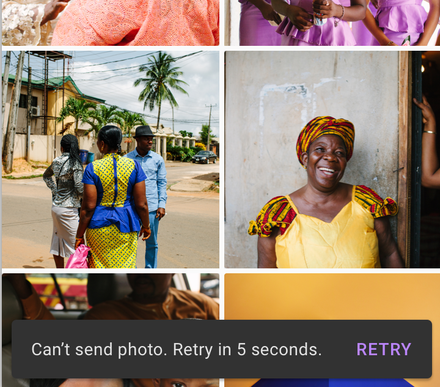

# Material Design {
	data-background="../images/logo-materialdesign.svg"
	data-background-size='40%'
	}

## Librerias componentes {
	data-background="../images/logo-materialdesign.svg"
	data-background-size='40%'
	}

Bootstrap (Twitter)

Material (Google)

JQuery-UI

...

## Origen {
	data-background="../images/logo-materialdesign.svg"
	data-background-size='40%'
	}

<div class="columns">

<div class="column" style="width:60%">

**Material Design** http://material.io

**Especificación** de cómo han de ser las interfaces en **Android**
a partir de Lollypop

Generalizado a otros soportes como el web.

Multiples implementaciones.

</div>
<div class="column" style="width:30%">
{width=100%}
</div>
</div>


## Component List {
	data-background="../images/logo-materialdesign.svg"
	data-background-size='40%'
	}

<div class="columns">
<div class="column">
Button

Slider

Switch

TextField

Selects

Checkbox

RadioButton
</div>
<div class="column">
LayoutGrid

List

GridList

ImageList

Tabs

Chip

Progress
</div>
<div class="column">
AppBar

Drawer

Card

SnackBar

Banner

Dialog

Sheet
</div>
</div>


## Navegación {
	data-background="../images/logo-materialdesign.svg"
	data-background-size='40%'
	}


**Lateral:** pantallas al mismo nivel accesibles en todo momento.
(Tabs, Drawer, Bottom Navigation Bar)

**Progreso:** profundizar en el nivel jerárquico
(Button, List, Grid List, Image list...)

**Atrás:** Cronológico o jeràrquico
(Back button)

## Comunicación {
	data-background="../images/logo-materialdesign.svg"
	data-background-size='40%'
	}


<div class=columns>
<div class=column style="width:30%">
{width=80%}

Persistente

Bloqueante
</div>
<div class=column style="width:30%">


Persistente

No bloqueante
</div>
<div class=column style="width:30%">


Temporal
</div>

## Sistema de Color {
	data-background="../images/logo-materialdesign.svg"
	data-background-size='40%'
	}

{width="60%"}

## Tema de Color {
	data-background="../images/logo-materialdesign.svg"
	data-background-size='40%'
	}

**Primary**, **Secondary** y sus variantes **light** y **dark**.

Las **variantes** para destacar de forma harmoniosa.

**Secondary** para dar acento especial.

**Background** para el fondo estatico.

**Surface** para las cosas que se elevan sobre el fondo.

**OnX:** El color de texto cuando se usa _X_ como fondo


## ¿Material para Mithril? {
	data-background="../images/logo-materialdesign.svg"
	data-background-size='40%'
	}

**[Polythene](https://github.com/ArthurClemens/Polythene):**
Lo usamos en el [Tomàtic](https://github.com/Som-Energia/somenergia-tomatic).
Calcula los estilos en el navegador,
y pierde lo que ganas con Mithril.

**Mithril MDL:** wrapper para Mithril de Material Design Lite de Google.
Menos completo, mucho más rápido. Estilos precompilados.

MDL fue discontinuado en favor de
**Material Components 4 Web**
que aún no tiene wrapper Mithril.


## MD Components 4 Web {
	data-background="../images/logo-materialdesign.svg"
	data-background-size='40%'
	}

Implementación Web de Google

Incompleta como todas, en progreso rápido.

En vez de concentrarse en un framework da herramientas
para usarlo en cualquiera.

Nosotros haremos el wrapping para Mithril:
`src/mdc/` ([link](https://github.com/Som-Energia/webforms-mithril/tree/master/src/mdc))


## Estructura {
	data-background="../images/logo-materialdesign.svg"
	data-background-size='40%'
	}

**Estilos:**

Implementados con Sass.

Customizables (¡precalculados!)

**Javascript:**

Cuando necesitan inicializacion

Cuando Ofrecen API.

## MDC Button en Mithril {
	data-background="../images/logo-materialdesign.svg"
	data-background-size='40%'
	}

Sin Javascript, basado solo en estilos

```javascript
require('@material/button/dist/mdc.button.css');
var Button = {
	view: function(vn) {
		return  m('button.mdc-button'
			+(vn.attrs.raised ? '.mdc-button--raised':'')
			+(vn.attrs.unelevated ? '.mdc-button--unelevated':'')
			+(vn.attrs.outlined ? '.mdc-button--outlined':'')
			+(+vn.attrs.dense ? '.mdc-button--dense':'')
			, attrs, [
			(vn.attrs.faicon ? m(
				'i.mdc-button__icon.fa.fa-'+vn.attrs.faicon):''),
			vn.children
		]);
	},
};
```

## Uso del MDC Button {
	data-background="../images/logo-materialdesign.svg"
	data-background-size='40%'
	}

```javascript
var Button = require('./mdc/button');

var App = {
	clicked: false,
	view: function(vn) {
		return  m(Button, {
			raised: true,
			faicon: this.clicked?'spinner.fa-spin':'paper-plane',
			onclick: function(ev) {
				vn.state.clicked = true;
			},
		}, 'Send');
	},
};
```

## Como pinta {
	data-background="../images/logo-materialdesign.svg"
	data-background-size='40%'
	}


## MDC Dialog en Mithril {
	data-background="../images/logo-materialdesign.svg"
	data-background-size='40%'
	}

Inicializando y con API.

```javascript
const mdcDialog = require('@material/dialog');
const MDCDialog = mdcDialog.MDCDialog;
var Dialog = {};
Dialog.oninit = function(vn) {
	// Para poder acceder desde fuera a la API
	vn.state.model = vn.attrs.model || {};
	// Api publica del componente Mithril
	vn.state.model.open = function() {
		vn.state.widget.show();
	};
};
Dialog.oncreate = function(vn) {
	vn.state.widget = MDCDialog.attachTo(vn.dom);
	vn.state.widget.listen('MDCDialog:accept', function() {
		vn.attrs.onaccept && vn.attrs.onaccept();
	});
	vn.state.widget.listen('MDCDialog:cancel', function() {
		vn.attrs.oncancel && vn.attrs.oncancel();
	});
};
```


