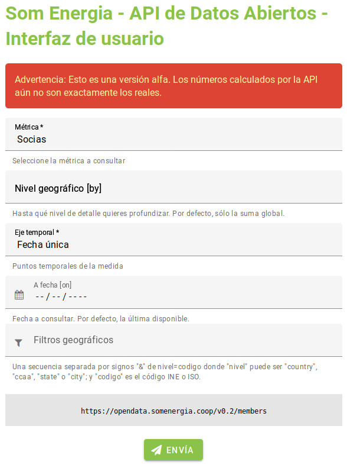

# API

## Open Data

Acceso a datos anonimizados por agregación

[`http://opendata.somenergia.coop`](http://opendata.somenergia.coop){target=_blank}

En la raiz está la documentación

**Da pie a proyectos para voluntarios y estudiantes**

- Explotar los datos
- Ampliar funcionalidades

## Métricas y detalle

**Métricas:**

`/v0.2/members` (socias)

`/v0.2/contracts` (contratos)

**Detalle geográfico:**
Por defecto global.

`/by/<level>`
(`country`, `state`, `ccaa`, `city`)

## Serie temporal

**Por defecto:** la última fecha disponible

**A fecha dada:** `/on/<date>`

(solo primeros de mes, de momento)

**Serie anual:** `/yearly[/from/<date>][/to/<date>]`

**Serie mensual:** `/monthly[/from/<date>][/to/<date>]`

## Filtros geográficos

En la query string.

`?ccaa=01&city=38017&city=38019`

Incluiría Andalucía (01) y los municipios Tinerfeños de 
_Granadilla de Abona_ (38017) y
_Guía Isora_ (38019)

Se usan los códigos del INE ([web](http://www.ine.es/daco/daco42/codmun/codmunmapa.htm){target=_blank})

# Interfaz para humanos

## 

{width=40%}

## Función

Acceso a personas no programadoras

Grupos locales, Equipo técnico

- Construir queries
- Visualizar resultados

## Posibles mejoras

Editor de filtros

Mejorar la tabla

Integrar nuevas visualizaciones

Descarga en diferentes formatos

Generar widgets para el blog

## Wanna hack?

[`github:som-energia/webforms-mithril`](github.com/som-energia/webforms-mithril`)

Tecnologías utilizadas:

- Mithril: control aplicación
- MDC4W: widgets de base
- Webpack: optimización y empacado
- NodeJS: dependencias

Explicadas en una formación 'interna'

[enlace]()

# Ideas de proyectos

## Nuevas métricas

Consumo agregado,
Producción,
Plantas,
Autoproducción
...

**Referéncias para métricas relativas:**
Población,
Superficie,
Puntos de suministro
...

## Formatos y visualizaciones

**Formatos:** Soportar JSON, CSV... no solo YAML

**Visualizaciones:** Usando los datos de la API o integradas en la API como formato de salida

Gráficas -
Mapas -
Animaciones -
Interactivos

¿Concurso?

## Frontend

Construcción interactiva de la query

Integración de las visualizaciones

Conversor Grupo Local -> lista de municipios

Generación de snippets para integrar en el blog

