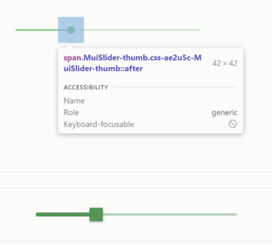
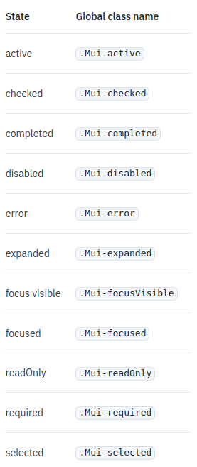
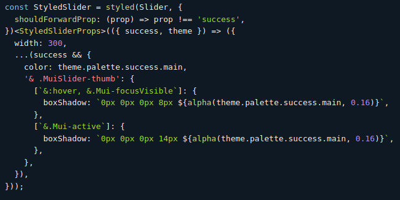
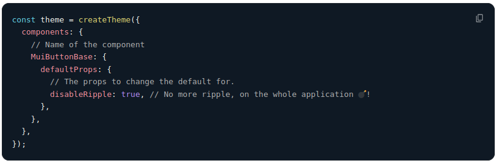
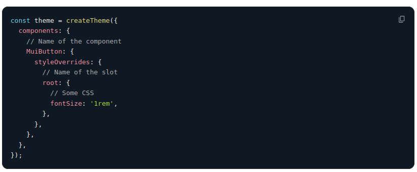
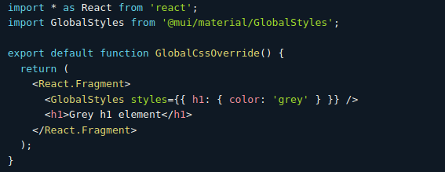
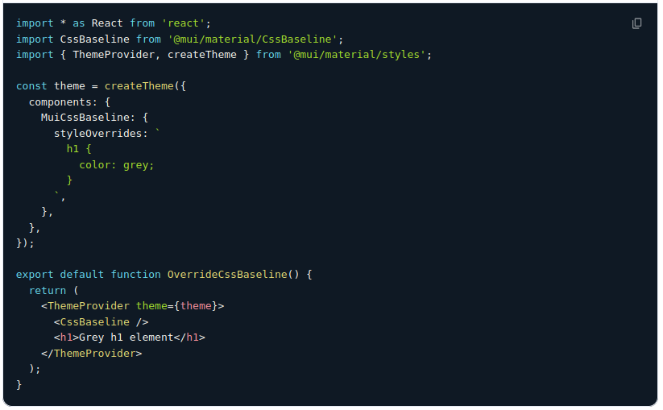
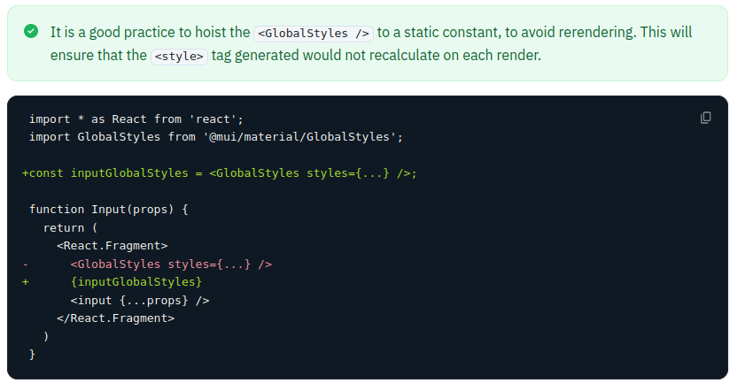

## Personalització a MUI

### [make Styles](https://mui.com/system/styles/basics/) (v4 deprecated!)

```jsx
import * as React from 'react';
import { makeStyles } from '@mui/styles';
import Button from '@mui/material/Button';

const useStyles = makeStyles({
  root: {
    boxShadow: '0 3px 5px 2px rgba(255, 105, 135, .3)',
    padding: '0 30px',
  },
});

export default function Hook() {
  const classes = useStyles();
  return <Button className={classes.root}>Hook</Button>;
}
```

:::notes

El que apliquem el component es similar als CSS modules.

El css l'escrivim com a objecte javascript no CSS extern.

Retorna una estructura similar als css modules. Els estils estan scoped.

API's alternatives fent servir styled i el wrapper withStyles (higher ordre component)

Podiem parametritzar-ho fent que els valors de les propietats fossin funcions rebent unes propietats.

Fem servir el thema passant-ho com a propietas d'aquesta funció.

Soportava selectors aniuats per accedir a subcomponents o pseudostats.

Al mateix fitxer pero separat del JSX. Junts sense barrejar-se. Més net i a prop del HTML.

Hi ha com moltes passes per obtindre el mapa de classes: createStyle, makeStyles, useStyles, classes


Fins ara a la part de frontend s’ha utilitzat el makeStyles per crear els estils dels components.
Aquesta opció es treia de la llibreria styles de mui, que quedarà obsoleta i a partir de react 18,
el mode estricte de react no permetrà el seu ús.
Per tant tot el codi que estigui així s’haurà de revisar i segurament canviar.

Alerta: Els projectes que ho fan servir caldrà migrar-los!!!
:::

### Personalització: `sx` attribute

Segons la documentació,\
la millor manera d'afegir estils als components MUI\
Es pot fer servir a tots els components MUI

En l'exemple següent podem veure com customitzem el component base:

```jsx
<Slider
    defaultValue={30}
    sx={{
        width: 300, // Unitats del tema
        color: 'success.main', // access als colors del tema
    }}
/>
```

### Personalitzar parts del component

:::columns
::::column
```jsx
<Slider
  defaultValue={30}
  sx={{
    width: 300,
    color: 'success.main',
    '& .MuiSlider-thumb': {
      borderRadius: '1px',
    },
  }}
/>
```
::::
::::column

::::
:::

:::notes
Podem accedir a parts especifiques del component
fent servir `&` i la classe del subcomponent.

Però també podem accedir a parts específiques del component
com per exemple en el cas de l'Slider,
podem accedir a l'icona que es mou.
Per defecte és rodó però el podem fer quadrat
sobreescribint els estils de la part concreta.

Material ui, ens dou que per fer-ho necessitem
`Mui<Component name>-<name of the slot>`.

En el cas concret que volem ara seria MuiSlider-thumb,
on Slider és el component i thumb ´es l'slot.
:::

### Sobrescrivint amb className

:::columns
::::column
```css
// PlainCssSlider.css
.slider {
  color: #20b2aa;
}
.slider:hover {
  color: #2e8b57;
}
.slider .MuiSlider-thumb {
  border-radius: 1px;
}
```
::::
::::column
```jsx
// PlainCssSlider.jsx
import React from 'react'
import Slider from '@mui/material/Slider'
import 'PlainCssSlider.css'

export default function PlainCssSlider() {
  return  <>
    <Slider defaultValue={30} />
    <Slider
        defaultValue={30}
        className="slider"
    />
  </>
}
```
::::
:::

:::notes
També pots sobreescriure estils css,
utilitzant el prop `className` en qualsevol dels components
utilitzant el nom de les classes que et proporciona material ui.

Si en comptes de css normals,
fem servir css modules,
evitarem colisions d'estils.
:::


### Estilant l'estat

Canvis d'estat d'un component:\
`hover`, `focus`, `disabled`...

Problema: L'estat afegeix especificitat\
Cal augmentar la dels descriptors per personalitzar

:::columns
::::column
```jsx
<Button disabled className="Button" />
```
::::
::::column
```css
.Button {
  color: black;
}
/* Increase specificity */
.Button:disabled {
  color: white;
}
```
::::
:::

:::notes
Són selectors amb un nivell alt d'especificació.\
Per poder costumitzar-ho, hem de fer-ho amb\
un nivell més alt d'especificació.\

Per exemple en un Botó,
podem especificar el disabled i assignar aquesta
classe a aquell botó
:::

### Estilant l'estat

:::columns
::::column
Problema: Les pseudoclasses només s'apliquen als sub-components nadius.

Per afectar a la resta d'elements dels components,
cal fer servir les classes que insereix MUI quan canvia l'estat.

```css
.Button {
  color: black;
}
/* Increase specificity */
.MenuItem.Mui-selected {
  color: blue;
}
```
::::
::::column
```jsx
<Button disabled className="Button" />
```
{width="40%"}
::::
:::


### Components reusables (`styled`)

:::notes
Una altra manera de posar estils als components
és creant components Custom a partir de components de material ui.

Per exemple, podem partir d'un Slider per crear el nostre SuccessSlider,
que serà el component base més els estils que li volguem aplicar,
retornant-nos un component custom i reutilitzable per a l'aplicació
:::

```jsx
import * as React from 'react';
import Slider from '@mui/material/Slider';
import { alpha, styled } from '@mui/material/styles';

const SuccessSlider = styled(Slider)(({ theme }) => ({
  width: 300,
  color: theme.palette.success.main,
  '& .MuiSlider-thumb': {
    '&:hover, &.Mui-focusVisible': {
      boxShadow: `0px 0px 0px 8px ' +
        '${alpha(theme.palette.success.main, 0.16)}`,
    },
    '&.Mui-active': {
      boxShadow: `0px 0px 0px 14px ' +
        '${alpha(theme.palette.success.main, 0.16)}`,
    },
  },
}))
```

### Dynamic Overrides

:::notes
Com canviar els estils amb informació en temps d'execució?

`styled` ens permet afegir estils dinamics com props del component de
dues maneres

Amb `sx` ho podríem fer directament sense lambdas
perque els diccionaris es calculen dins del render.
:::

[*Dynamic CSS*](https://mui.com/material-ui/customization/how-to-customize/#dynamic-overrides)

{width="80%"}

### Dynamic Overrides

[*Variables CSS*](https://mui.com/material-ui/customization/how-to-customize/#dynamic-overrides)

:::columns
::::column
```jsx
const CustomSlider = styled(Slider)({
  width: 300,
  color: 'var(--color, 'black')',
  '& .MuiSlider-thumb': {
    [`&:hover, &.Mui-focusVisible`]: {
      boxShadow: '0px 0px 0px 8px var(--box-shadow, 'grey')',
    },
    [`&.Mui-active`]: {
      boxShadow: '0px 0px 0px 14px var(--box-shadow, 'grey')',
    },
  },
});
```
::::
::::column
```jsx
const vars = {
    '--color': '#4caf50'
    '--box-shadow': 'rgb(76, 175, 80, .16)',
}
return <CustomSlider style={vars} />
```
::::
:::

### Global theme overrides

Una altra opció és crear un tema.
No només per definir els colors i la
typografia sinó que també pots accedir a cadascuna de les
classes/components de mui, i pots sobreescriure els estils i inclús la
definició de les props bases.

### Global theme overrides

Definim el comportament de la prop `disableRipple`
del `MuiButtonBase`

{width="80%"}

### Global theme overrides

Redefinim els estils del botó.
Canviem la mida de la lletra per tots els botons

{width="80%"}

### Global CSS override

Pots fer servir el GlobalStyles per customitzar estils d'alguns dels
elements d'html. Per exemple:

{width="80%"}

### Global CSS override

Si vols fer servir el CSSBaseline, pots sobreescriure els estils dels
components de la següent manera:

{width="80%"}

### Global CSS override
Si das servir el GlobalStyles, és millor posar-ho a una constant per no
renderitzar cada vegada

{width="80%"}

### Migració MUI4 -> MUI5

[*Guia de passar de mui4 a mui5*](
https://mui.com/material-ui/migration/migration-v4/)


