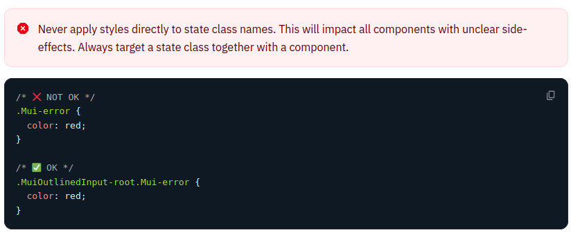

## MUI

### make Styles (v4 deprecated!)

Fins ara a la part de frontend s'ha utilitzat el makeStyles per crear
els estils dels components. Aquesta opció es treia de la llibreria
styles de mui, que quedarà obsoleta i a partir de react 18, el mode
estricte de react no permetrà el seu ús. Per tant tot el codi que
estigui així s'haurà de revisar i segurament canviar.

Alerta: Els projectes que ho fan servir caldrà migrar-los!!!

### Customization: `sx` attribute

Segons la documentació de material ui, utilitzar sx és la millor manera
d'afegir estils als components de material. Es pot fer servir en
qualsevol component.

En l'exemple següent podem veure com customitzem el component base:

```jsx
<Slider
    defaultValue={30}
    sx={{
        width: 300, // Unitats del tema
        color: 'success.main', // access als colors del tema
    }}
\>
```

### Customitzar parts del component

:::notes
Però també podem accedir a parts específiques del component com per
exemple en el cas de l'Slider, podem accedir a l'icona que es mou. Per
defecte és rodó però el podem fer quadrat sobreescribint els estils de
la part concreta. Material ui, ens dou que per fer-ho necessitem
Mui\[Component name\] - \[name of the slot\]. En el cas concret que
volem ara seria MuiSlider-thumb, on Slider és el component i thumb ´es
l'slot.
:::

{width="80%"}

### Overriding styles with class names

:::notes
També pots sobreescriure estils css, utilitzant el prop className en
qualsevol dels components utilitzant el nom de les classes que et
proporciona material ui.
:::

Entre d'altres maneres, que podem veure
[*aquí*](https://mui.com/material-ui/integrations/interoperability/), es
pot fer així:

{width="80%"}

### State classes

Estats com per exemple hover, focus, disabled, etc. Són estils amb un
nivell alt d'especificació. Per poder costumitzar-ho, hem de fer-ho amb
un nivell més alt d'especificació.

Per exemple en un Botó, podem especificar el disabled i assignar aquesta
classe a aquell botó, Exemple de codi:

{width="80%}

No sempre podem accedir a les classes d'estat de CSS, però ho podem fer
dins de les definides del component de material que volem modificar. Per
exemple en el cas del MenuItem, hem d'accedir a .Mui-selecrted en
comptes de seleceted (CSS).

{width="80%"}

{width="80%"}

{width="80%"}

### Reusable component

Una altra manera de posar estils als components és creant components
Custom a partir de components de material ui. Per exemple podem partir
d'un Slider per crear el nostre SuccessSlider, que serà el component
base més els estils que li volguem aplicar, retornant-nos un component
custom i reutilitzable per a l'aplicació Es faria de la manera següent:

{width="80%"}

### Dynamic Overrides

l'styled ens permet afegir estils dinamics com props del component de
dues maneres:

- [*Dynamic CSS*](https://mui.com/material-ui/customization/how-to-customize/#dynamic-overrides)

{width="80%"}

- [*Variables CSS*](https://mui.com/material-ui/customization/how-to-customize/#dynamic-overrides)

{width="80%"}

### Global theme overrides

Una altra opció és crear un tema. No només per definir els colors i la
typografia sinó que també pots accedir a cadascuna de les
classes/components de mui, i pots sobreescriure els estils i inclús la
definició de les props bases. Per exemple:

-   Definim el comportament de la prop disableRipple del MuiButtonBase

{width="80%"}

-   Redefinim els estils del botó. Canviem la mida de la lletra per tots
    els botons

{width="80%"}

### Global CSS override

Pots fer servir el GlobalStyles per customitzar estils d'alguns dels
elements d'html. Per exemple:

{width="80%"}

Si vols fer servir el CSSBaseline, pots sobreescriure els estils dels
components de la següent manera:

{width="80%"}

Si das servir el GlobalStyles, és millor posar-ho a una constant per no
renderitzar cada vegada

{width="80%"}

[*Guia de passar de mui4 a mui5*](
https://mui.com/material-ui/migration/migration-v4/)


