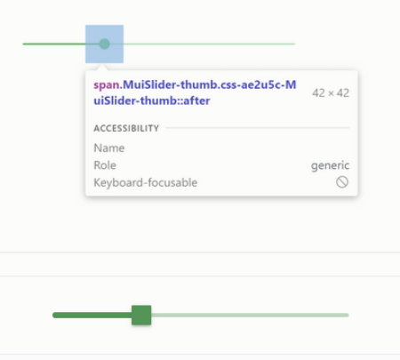
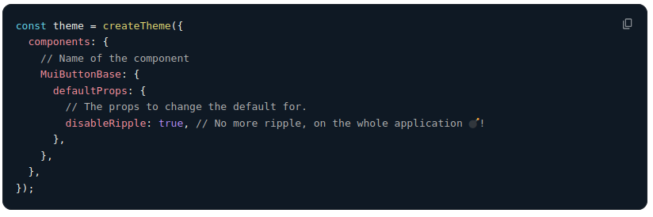
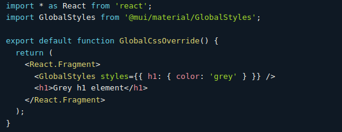
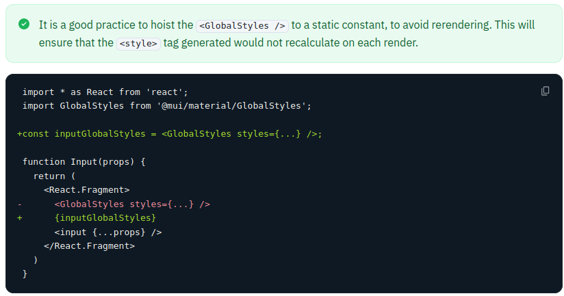
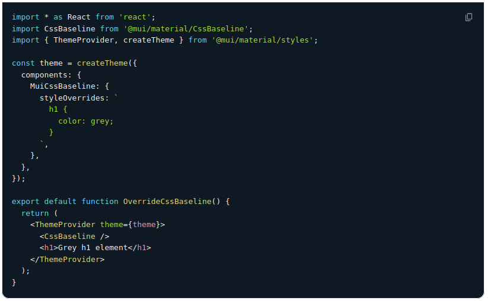

# Personalització a MUI

## Variants, atributs...

Components MUI molt estilats per defecte.\
Cada versió canvia el métode per estilar.

Personalització via atributs API:\
`variant`, `dense`, `disableGutters`, `margin`, `color`...

Els components estructurals (`Box`, `Grid`, `Stack`...)\
prenen els atributs html com atributs CSS\
`gap`, `margin`, `justifyItems`...


:::notes
**Estilat complert vs customització vs temes**

MUI estila molt els components per defecte,
per adherir-se a l'estandard Material Design.

És complexe sobrescriure aquests estils
i fer-los compatibles amb els temes que també defineix MD.
Per això, cada versió intenta millorar el sistema d'estilat i de temificació.
Aquesta part de MUI es força inestable.

**Atributs de personalització**

La forma menys intrusiva de customitzar,
es fer servir els **atributs de personalització**
que ofereix cada component.
Es detallen a la documentació de l'API de cada component.

Son personalitzacions previstes i han de funcionar sense problemes.
Les versions successives, si canvia, indicaran una via clara de migració.

Si modifiquem els css o entrem a l'estructura interna del component,
tenim més risc que futures migracions siguin complicades.

**Attributs d'elements estructurals**

Els elements estructurals ja estan pensats per traduïr
els atributs html que coincideixin amb propietats css.
Hauríem de poder fer-los servir sense perill d'incompatibilitat.
:::

## [`makeStyles`](https://mui.com/system/styles/basics/)

Deprecat en Mui5! Incompatible React18!

```jsx
import * as React from 'react';
import { makeStyles } from '@mui/styles';
import Button from '@mui/material/Button';

const useStyles = makeStyles({
  mybutton: {
    boxShadow: '0 3px 5px 2px rgba(255, 105, 135, .3)',
    padding: '0 30px',
  },
});

export default function Hook() {
  const classes = useStyles();
  return <Button className={classes.mybutton}>Hook</Button>;
}
```

:::notes

Aquest es el mètode que feiem servir majoritàriament als nostres projectes MUI4/React16.

👎 **En MUI5 està deprecat**, i **no estarà disponible a MUI6**.
A més es basa en una llibreria, JSS, que **no es compatible amb React 18**.
Ho expliquem per entendre el codi que **haurem de migrar**.

El css l'escrivim com a objecte JS al codi.\
Com CSS Modules, genera classes uniques concatenant un uid
i `useStyles` retorna un diccionari:
`{ mybutton: "mybutton-tirallonga"}`

Per accedir al tema, passem una funció en comptes d'un objecte.
```jsx
const useStyles = makeStyles((theme) =>({
  color: theme.palette.primary.main,
}))
```

API's alternatives fent servir styled i el wrapper withStyles (higher ordre component)

👍 Soportava selectors aniuats per accedir a subcomponents o pseudostats.

👍 Al mateix fitxer pero separat del JSX.
Junts sense barrejar-se. Més net i a prop del HTML.

👎 Hi ha com moltes passes per obtindre el mapa de classes: createStyle, makeStyles, useStyles, classes

:::

## `sx` attribute

Segons la documentació,\
la millor manera d'afegir estils als components MUI\
Es pot fer servir a tots els components MUI

En l'exemple següent podem veure com customitzem el component base:

```jsx
<Slider
    defaultValue={30}
    sx={{
        padding: 1, // 1 step d'spacing del tema
        color: 'success.main', // access als colors del tema
    }}
/>
```

:::notes

**`sx` (Mui) vs `style` (React)**

Ambdós poden rebre un string o un objecte representant el css.
`sx`, a més fa:

- Selectors aniuats i pseudo estats amb `&`
- Access als elements del tema per nom
- Dreceres per mediaqueries  (responsive)
- Mapeig inteligent dels valors depenent de la propietat
- ...

**Parany!**
Fer servir a `style` les goodies de `sx`.
No funcionen i les ignorarà o donarà errors:

**Parany!** 
Fer servir `sx` als elements que no son Mui (`div`, `table`, `ul`...).
Quan fem canvis i ens ignora, sol ser això.

Per elements HTML estàndard o d'altres llibreries,
l'estilat caldria fer-ho amb `style` de React,
però perdem les funcionalitats guais de `sx`.

Ho podem resoldre fent servir `Box` que es un `div`
pero processant `sx`.

Quan no sigui un `div`, podem especificar l'atribut `component`:

```jsx
  <Box component="ul">
    ...
  </Box>
```


:::

## Personalitzar parts del component

:::columns
::::column
```jsx
<Slider
  defaultValue={30}
  sx={{
    width: 300,
    color: 'success.main',
    '& .MuiSlider-thumb': {
      borderRadius: '1px',
    },
  }}
/>
```
::::
::::column

::::
:::

:::notes
Podem accedir a parts especifiques del component
fent servir `&` i la classe del subcomponent.

Però també podem accedir a parts específiques del component
com per exemple en el cas de l'Slider,
podem accedir a l'icona que es mou.
Per defecte és rodó però el podem fer quadrat
sobreescribint els estils de la part concreta.

Material ui, ens dou que per fer-ho necessitem
`Mui<Component name>-<name of the slot>`.

En el cas concret que volem ara seria MuiSlider-thumb,
on Slider és el component i thumb ´es l'slot.
:::

## Sobrescrivint amb className

:::columns
::::column
```css
// PlainCssSlider.css
.slider {
  color: #20b2aa;
}
.slider:hover {
  color: #2e8b57;
}
.slider .MuiSlider-thumb {
  border-radius: 1px;
}
```
::::
::::column
```jsx
// PlainCssSlider.jsx
import React from 'react'
import Slider from '@mui/material/Slider'
import 'PlainCssSlider.css'

export default function PlainCssSlider() {
  return  <>
    <Slider defaultValue={30} />
    <Slider
        defaultValue={30}
        className="slider"
    />
  </>
}
```
::::
:::

:::notes
També pots sobreescriure estils css,
utilitzant el prop `className` en qualsevol dels components
utilitzant el nom de les classes que et proporciona material ui.

Si en comptes de css normals,
fem servir css modules,
evitarem colisions d'estils.

```jsx
// PlainCssSlider.jsx
import React from 'react'
import Slider from '@mui/material/Slider'
import style from 'PlainCssSlider.module.css' // <- Canvi

export default function PlainCssSlider() {
  return  <>
    <Slider defaultValue={30} />
    <Slider
        defaultValue={30}
        className={style.slider} // <- Canvi
    />
  </>
}
```
:::


## Estilant l'estat

Canvis d'estat d'un component:\
`hover`, `focus`, `disabled`...

Problema: L'estat afegeix especificitat\
Cal augmentar la dels descriptors per personalitzar

:::columns
::::column
```jsx
<Button disabled className="Button" />
```
::::
::::column
```css
.Button {
  color: black;
}
/* Increase specificity */
.Button:disabled {
  color: white;
}
```
::::
:::

:::notes
Són selectors amb un nivell alt d'especificació.\
Per poder costumitzar-ho, hem de fer-ho amb\
un nivell més alt d'especificació.\

Per exemple en un Botó,
podem especificar el disabled i assignar aquesta
classe a aquell botó
:::

## Estilant l'estat

:::columns
::::column
Problema: Les pseudoclasses només s'apliquen als sub-components nadius.

Per afectar a la resta d'elements dels components,
cal fer servir les classes que insereix MUI quan canvia l'estat.

```css
.Button {
  color: black;
}
/* Increase specificity */
.MenuItem.Mui-selected {
  color: blue;
}
```
::::
::::column
```jsx
<Button disabled className="Button" />
```
{width="40%"}
::::
:::


## Funció `styled`

:::notes
Una altra manera de posar estils als components
és creant components Custom a partir de components de material ui.

Per exemple, podem partir d'un Slider per crear el nostre SuccessSlider,
que serà el component base més els estils que li volguem aplicar,
retornant-nos un component custom i reutilitzable per a l'aplicació
:::

```jsx
import * as React from 'react';
import Slider from '@mui/material/Slider';
import { alpha, styled } from '@mui/material/styles';

const SuccessSlider = styled(Slider)(({ theme }) => ({
  width: 300,
  color: theme.palette.success.main,
  '& .MuiSlider-thumb': {
    '&:hover, &.Mui-focusVisible': {
      boxShadow: `0px 0px 0px 8px ' +
        '${alpha(theme.palette.success.main, 0.16)}`,
    },
    '&.Mui-active': {
      boxShadow: `0px 0px 0px 14px ' +
        '${alpha(theme.palette.success.main, 0.16)}`,
    },
  },
}))
```

## Dynamic Overrides

:::notes
Com canviar els estils amb informació en temps d'execució?

`styled` ens permet afegir estils dinamics com props del component de
dues maneres

Amb `sx` ho podríem fer directament sense lambdas
perque els diccionaris es calculen dins del render.
:::

[*Dynamic CSS*](https://mui.com/material-ui/customization/how-to-customize/#dynamic-overrides)

{width="80%"}

## Dynamic Overrides

[*Variables CSS*](https://mui.com/material-ui/customization/how-to-customize/#dynamic-overrides)

:::columns
::::column
```jsx
const CustomSlider = styled(Slider)({
  width: 300,
  color: 'var(--color, 'black')',
  '& .MuiSlider-thumb': {
    [`&:hover, &.Mui-focusVisible`]: {
      boxShadow: '0px 0px 0px 8px var(--box-shadow, 'grey')',
    },
    [`&.Mui-active`]: {
      boxShadow: '0px 0px 0px 14px var(--box-shadow, 'grey')',
    },
  },
});
```
::::
::::column
```jsx
const vars = {
    '--color': '#4caf50'
    '--box-shadow': 'rgb(76, 175, 80, .16)',
}
return <CustomSlider style={vars} />
```
::::
:::

## Global theme overrides

Per alterar l'estil per defecte\
de **totes** les instàncies d'un component\
ho podem fer al tema.

L'atribut `components` del tema\
conté personalitzacions globals
per cada component.

Podem canviar atributs per defecte
de les propietas del component,
o afegir propietats css.


:::notes
Per exemple, si volem canviar com es veuen tots els botons de l'aplicació.

**Parany!** Fer servir aquest mètode quan no volem canviar
totes les instàncies del component, només algunes.

Si només ho fem servir a un lloc,
millor customitzar el component amb `sx` on ho fem servir.

Si ho repetim pero no arreu, podem evitar la repetició,
creant un nou component, que personalitza l'estàndard amb `sx`.
:::

## Global theme overrides

Establim el valor per defecte de la prop\
`disableRipple` del `MuiButtonBase`

{width="80%"}

:::notes
Exemple més útil per nosaltres:

Establir la `variant` per defecte per TextField i Button.
Així no hem d'especificar tota l'estona que volem el `outlined`.
I si un dia volem canviar-ho, single point of modification.
:::

## Global theme overrides

Redefinim els estils del botó.
Canviem la mida de la lletra per tots els botons

{width="80%"}

:::notes
Els slots de cada component serien les parts que el formen,
i estan documentats a la API de cada component,
després de les propietas.
:::

## `CSSBaseline`

`CSSBaseline` proveeix **regles de reset**

Sovint els navegadors tenen diferents estils per defecte.

Les regles de reset aconsegueixen que tots els navegadors parteixin del mateix punt.

```jsx
<>
  <CSSBaseline /> // No es contenidor
  // ...Aqui el component
</>
```

:::notes
`CSSBaseline` no és contenidor.
Insereix un `<style>` al dom
amb regles que minimitzen les diverngències entre navegadors.

- Regles de baixa especificitat:
Selectors amb només elements html.
Sobrescrits per qualsevol que tingui una classe.
- Han d'aplicar-se abans de tot.

Normalment conté regles que només accept
:::

## Global CSS override

Pots fer servir el GlobalStyles per customitzar estils d'alguns dels
elements d'html. Per exemple:


{width="80%"}

:::notes
Genera un tag `<styles>` que s'aplica globalment

El seu ús recomanat es per setejar els **estils de base**:
Els que no estan relacionats amb cap component concret,
sino amb elements html planers,
de forma genèrica.

Tenen especificitat baixa.
Qualsevol estil amb un classname els sobrescriu.
:::

## Global CSS override

Si das servir el GlobalStyles, és millor posar-ho a una constant per no
renderitzar cada vegada

{width="80%"}

:::notes
Rescriure l'element `style` cada cop
provoca un redibuixat de la pàgina.

Mui aconsella extreure el component `GlobalStyles`
de la funció render del component
per evitar aquests recàlculs
:::

## Global CSS override

Si vols fer servir el CSSBaseline, pots sobreescriure els estils dels
components de la següent manera:

{width="80%"}

:::notes
`CSSBaseline` també generar `<style/> però está pensat com a `reset`.

Conté les regles CSS necessaries per assegurar que
tots els navegadors parteixen del primer
tingui el mateix aspecte.
:::


## Migració MUI4 -> MUI5

[*Guia de passar de mui4 a mui5*](
https://mui.com/material-ui/migration/migration-v4/)


